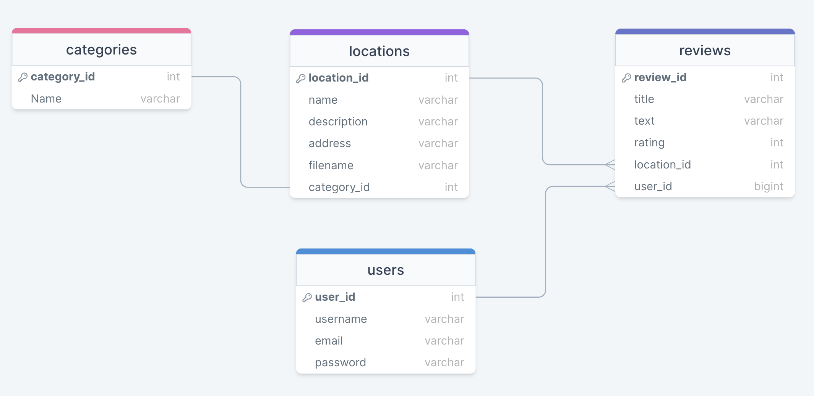

# Discovering Denver

## Description

Discovering Denver is a full-stack application allowing users to learn more about Denver hot spots. Read reviews and see what others have to say or post your own to share an experience.

## Technologies Used

- Express.js
- Sequelize
- MySQL2
- bcrypt
- dotenv
- Lemonade
- Handlebars.js
- Bootstrap
- Google Fonts

## Collaboration

This team includes James Geneser, George Harrison, Francisco Gutierrez Rodarte, Mia Mauro, and Thomas Wray.

## Application

[Discovering Denver](https://whispering-dawn-72162.herokuapp.com/)

## Screenshots

Homepage

SQL Table Structure

## Links

[Presentation](https://www.figma.com/proto/ELhiX5QsjItcPCrDHaR6sv/Discovering-Denver-Presentation?node-id=1-2&scaling=contain&page-id=0%3A1&starting-point-node-id=1%3A2)
